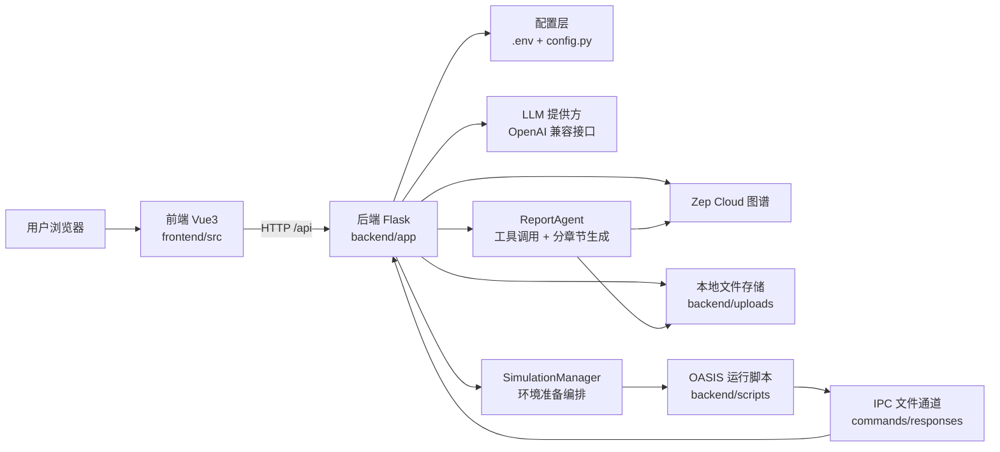

# MiroFish 技术架构分析

## 1. 项目定位

MiroFish 是一个面向“现实事件推演预测”的多智能体系统，核心链路是：

1. 上传现实种子材料（PDF/MD/TXT）和模拟需求。
2. 自动抽取本体并构建图谱（GraphRAG）。
3. 基于图谱生成智能体画像与模拟参数。
4. 运行双平台社交模拟（类似信息流平台 + 社区平台）。
5. 由 Report Agent 产出结构化分析报告。
6. 用户可继续与 Report Agent 或模拟个体深度互动。

从技术形态看，这是一个 **Vue3 单页应用 + Flask 后端 + Zep 图谱记忆 + OASIS 仿真引擎** 的组合系统。

## 2. 总体架构图

## 3. 技术栈

### 3.1 前端

- Vue 3 + Vue Router（`frontend/package.json`）
- Vite（`frontend/vite.config.js`），默认端口 `3000`
- Axios + 重试封装（`frontend/src/api/index.js`）
- D3 图可视化（`frontend/src/components/GraphPanel.vue`）

### 3.2 后端

- Flask + Flask-CORS（`backend/pyproject.toml`）
- OpenAI SDK 兼容调用（`backend/app/utils/llm_client.py`）
- Zep Cloud SDK（图谱存储与检索）
- CAMEL OASIS（双平台社交仿真）
- PyMuPDF + 编码检测（文档解析）

### 3.3 运行与部署

- Python `>=3.11`
- Node `>=18`
- Python 依赖管理 `uv`
- 根目录脚本统一编排（`npm run dev/setup:*`）
- Docker 单容器运行前后端（`Dockerfile`, `docker-compose.yml`）

## 4. 后端架构

### 4.1 入口与应用工厂

- 入口：`backend/run.py`
  - 启动前校验关键配置（`LLM_API_KEY`, `ZEP_API_KEY`）
  - 处理 Windows UTF-8 输出兼容
- 应用工厂：`backend/app/__init__.py`
  - 配置 JSON 编码与 CORS
  - 注入请求日志中间件
  - 注册三大蓝图：`/api/graph`、`/api/simulation`、`/api/report`
  - 注册模拟进程清理钩子

### 4.2 API 分层

- 图谱层：`backend/app/api/graph.py`
  - 项目管理、文件上传、本体生成、异步构图、任务查询、图谱查询
- 模拟层：`backend/app/api/simulation.py`
  - 模拟创建/准备/启动/停止、运行状态、动作时间线、访谈与环境控制
- 报告层：`backend/app/api/report.py`
  - 报告异步生成、分章节进度、下载、日志流、对话接口

### 4.3 状态模型与持久化

该项目以“文件系统持久化 + 局部内存状态”为主：

- `ProjectManager`（`backend/app/models/project.py`）
  - 持久化到 `backend/uploads/projects/<project_id>/`
- `TaskManager`（`backend/app/models/task.py`）
  - 内存单例，管理异步任务进度
- `SimulationState`（`simulation_manager.py`）
  - 持久化 `state.json`
- `SimulationRunState`（`simulation_runner.py`）
  - 持久化 `run_state.json` + 动作日志

### 4.4 服务编排层

核心服务职责划分清晰：

- `ontology_generator.py`：从文本生成实体/关系本体
- `graph_builder.py`：创建 Zep 图、设置本体、分块写入、轮询处理状态
- `zep_entity_reader.py`：读取并过滤实体，支持上下文补全
- `oasis_profile_generator.py`：将实体转为 OASIS Agent Profile（Reddit/Twitter格式）
- `simulation_config_generator.py`：LLM 生成时间/事件/平台/Agent 参数
- `simulation_manager.py`：准备流程总编排（Step2）
- `simulation_runner.py`：启动脚本、监控运行、管理进程、可选回写图谱记忆
- `simulation_ipc.py`：后端与模拟脚本的文件IPC（采访、关闭环境）
- `report_agent.py`：ReACT式报告生成、工具调用、分段写入、详细日志
- `zep_tools.py`：报告工具集（深度洞察、全景搜索、快速检索、访谈）

### 4.5 异步执行模型

后端并行模型有两类：

1. 进程内线程异步：构图、准备模拟、生成报告。
2. 进程外脚本异步：运行 OASIS 双平台模拟，通过文件/IPC交互。

## 5. 前端架构

### 5.1 路由与工作流

`frontend/src/router/index.js` 将系统设计为 5 步工作流：

1. `/`：首页上传与需求输入
2. `/process/:projectId`：Step1 图谱构建 + Step2 入口
3. `/simulation/:simulationId`：Step2 环境搭建
4. `/simulation/:simulationId/start`：Step3 模拟运行
5. `/report/:reportId`：Step4 报告生成
6. `/interaction/:reportId`：Step5 深度互动

### 5.2 组件分工

- `MainView.vue`：Step1/Step2 容器编排
- `GraphPanel.vue`：全流程复用图谱可视化面板
- `Step2EnvSetup.vue`：模拟环境准备可视化与参数展示
- `Step3Simulation.vue`：运行监控、动作时间线、报告触发
- `Step4Report.vue`：报告生成过程可观测化（工具调用、日志、章节）
- `Step5Interaction.vue`：Report Agent 对话 + 个体访谈 + 问卷模式
- `HistoryDatabase.vue`：历史推演回放入口

### 5.3 前端 API 封装层

- `src/api/graph.js`：图谱与项目接口
- `src/api/simulation.js`：模拟生命周期与运行态接口
- `src/api/report.js`：报告与对话接口
- `src/api/index.js`：Axios实例、统一拦截与重试

## 6. 核心业务链路（端到端）

### Step1 图谱构建

1. 前端上传文档 + 模拟需求。
2. 后端抽取文本并用 LLM 生成本体。
3. 后端异步构建 Zep 图谱并返回 task_id。
4. 前端轮询任务并刷新图谱展示。

### Step2 环境搭建

1. 创建 simulation 实例。
2. 读取图谱实体并过滤。
3. 生成人设（可并行、可LLM增强）。
4. 生成仿真配置（时间流速、事件、平台推荐参数等）。
5. 保存配置与脚本运行所需文件。

### Step3 开始模拟

1. 启动并行模拟脚本（Twitter + Reddit）。
2. 后端实时读取 run_state 与 actions 日志。
3. 前端按平台展示轮次、事件流和动作统计。
4. 可选将模拟行为动态回写 Zep 图谱记忆。

### Step4 报告生成

1. 异步启动报告任务。
2. Report Agent 先规划目录，再分章节生成。
3. 过程中多轮调用图谱工具并记录详细日志。
4. 前端实时展示章节进度、工具链、控制台输出。

### Step5 深度互动

1. 与 Report Agent 对话（`/api/report/chat`）。
2. 与模拟个体单聊/批量问卷（`/api/simulation/interview*`）。
3. 支持多对象会话缓存与结果聚合展示。

## 7. 数据落盘结构

主要运行数据在 `backend/uploads`：

- `projects/<project_id>/`
  - `project.json`
  - `extracted_text.txt`
  - 上传原文件
- `simulations/<simulation_id>/`
  - `state.json`
  - `simulation_config.json`
  - `reddit_profiles.json` / `twitter_profiles.csv`
  - `run_state.json`
  - `twitter/actions.jsonl`, `reddit/actions.jsonl`
  - IPC 命令与响应目录
- `reports/<report_id>/`
  - 报告元信息、分章节 markdown、最终 markdown
  - `agent_log.jsonl`, `console_log.txt`

## 8. 部署与运行方式

### 本地开发

- 全量启动：`npm run dev`
- 仅后端：`npm run backend`
- 仅前端：`npm run frontend`

### Docker

- 使用 `docker-compose.yml` 暴露 `3000/5001`
- 挂载 `backend/uploads` 保持数据持久化

## 9. 可观测性设计

项目可观测能力比较完整：

- 异步任务进度可查询
- 请求日志、构图日志、模拟动作日志
- 报告生成结构化日志 + 控制台日志
- 历史模拟回放接口与前端入口

## 10. 架构特点与优化建议

### 优点

1. 业务工作流和技术分层高度一致，扩展新步骤成本低。
2. 后端服务边界清晰，功能模块职责明确。
3. 从“生成”到“运行”到“解释”形成闭环，产品链路完整。
4. 运行与报告阶段可观测性较强，便于排障和演示。

### 当前风险点

1. 状态持久化主要依赖文件系统 + 内存任务管理，不利于多实例横向扩展。
2. 线程异步 + 文件读写在高并发下可能出现一致性问题，需要更强锁与事务策略。
3. 个别前后端接口契约存在潜在不一致，建议统一以 OpenAPI 管理。
4. 环境变量中的敏感密钥必须严格隔离，若已泄露需立即轮换。

### 演进方向

1. 引入 Redis/PostgreSQL 统一管理任务、状态与事件索引。
2. 用队列系统替代部分线程任务（如报告、构图、准备流程）。
3. 建立端到端集成测试覆盖 Step1-Step5 全链路。
4. 规范 API 契约和版本管理，降低前后端联调成本。

